# Guardrail-Ready AI Agent Risk Detection - Architecture Flow

This document explains the project structure with Mermaid diagrams.

Core sentence:

```text
Metric을 찍는 것에서 끝내지 않고,
metric 조합을 backend risk decision으로 변환한다.
```

## 1. 전체 구조

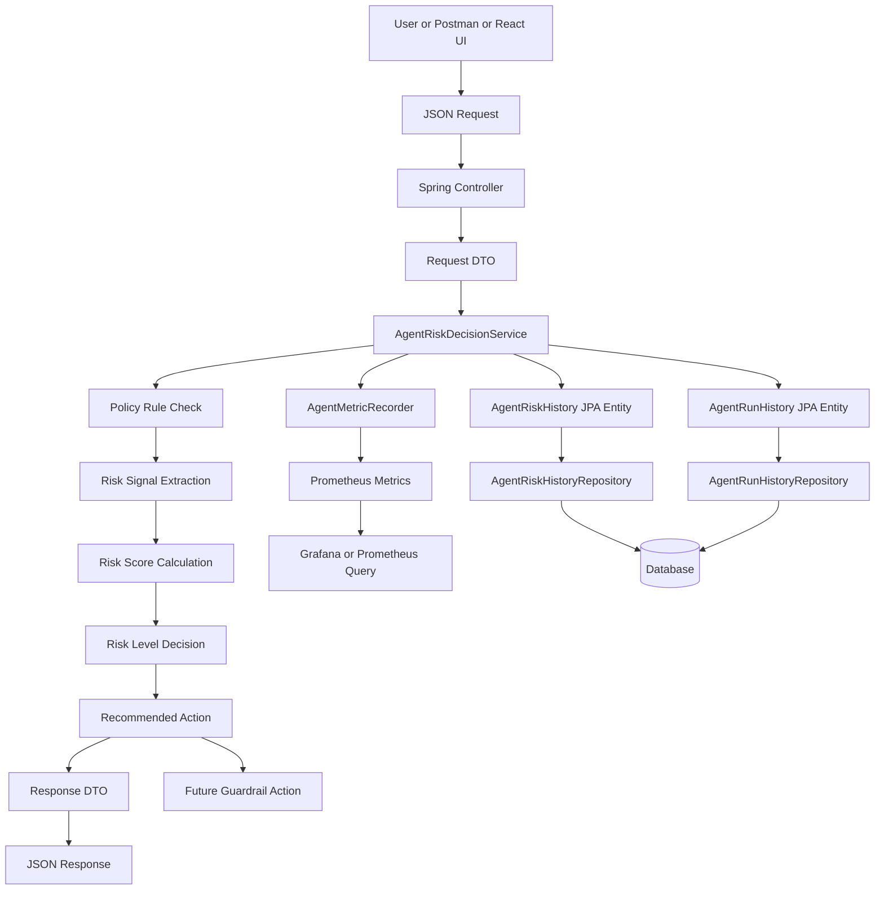

## 2. JSON 요청에서 백엔드 판단까지

```mermaid
flowchart LR
    A[Frontend Input] --> B[JavaScript Object]
    B --> C[JSON.stringify]
    C --> D[HTTP POST]
    D --> E[Spring @RequestBody]
    E --> F[AgentRiskAnalyzeRequest]
    F --> G[AgentRiskDecisionService]
    G --> H[AgentRiskAnalyzeResponse]
    H --> I[JSON Response]
    I --> J[Frontend Result Panel]
```

Example request:

```json
{
  "userInput": "upload sensitive customer report to external api repeatedly",
  "toolName": "external-api",
  "retryCount": 3,
  "policyViolation": true,
  "externalApiCall": true
}
```

Example response:

```json
{
  "decision": "HIGH_RISK_AGENT_BEHAVIOR",
  "riskScore": 89,
  "riskLevel": "HIGH",
  "signals": [
    "POLICY_VIOLATION",
    "RETRY",
    "EXTERNAL_API_CALL"
  ],
  "recommendedAction": "BLOCK_AND_ESCALATE",
  "guardrailReady": true
}
```

## 3. Risk Decision Engine 내부 흐름

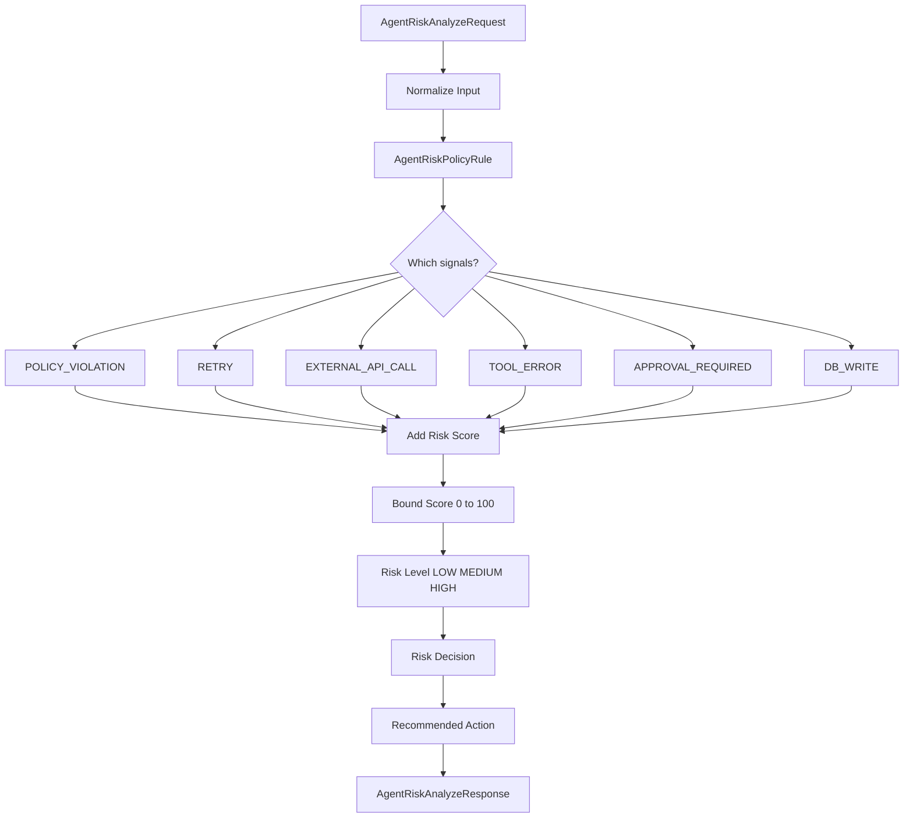

## 4. Decision Map

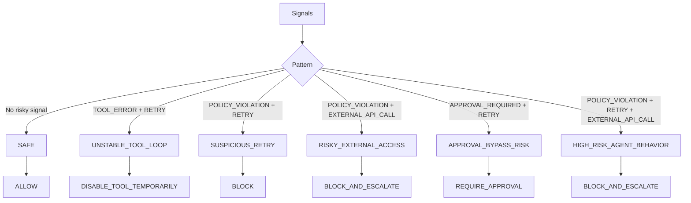

## 5. JPA와 SQL 저장 흐름

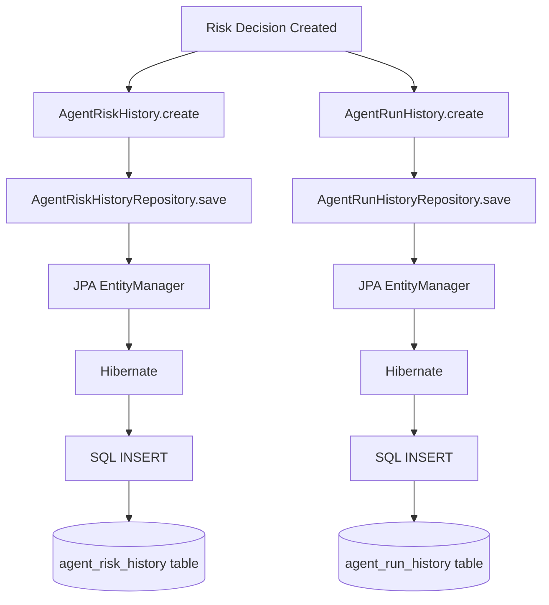

SQL examples:

```sql
select *
from agent_risk_history
order by created_at desc;
```

```sql
select decision, count(*)
from agent_risk_history
group by decision;
```

```sql
select recommended_action, count(*)
from agent_risk_history
group by recommended_action;
```

## 6. Prometheus Metric 흐름

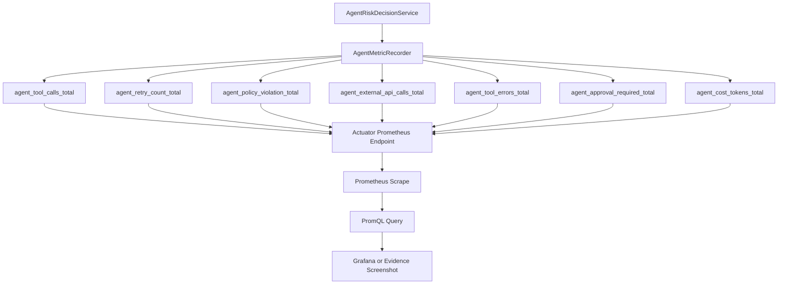

PromQL examples:

```promql
increase(agent_policy_violation_total[5m])
or
increase(agent_retry_count_total[5m])
or
increase(agent_external_api_calls_total[5m])
```

```promql
increase(agent_policy_violation_total[5m])
and
increase(agent_retry_count_total[5m])
and
increase(agent_external_api_calls_total[5m])
```

## 7. Prometheus와 DB History 차이

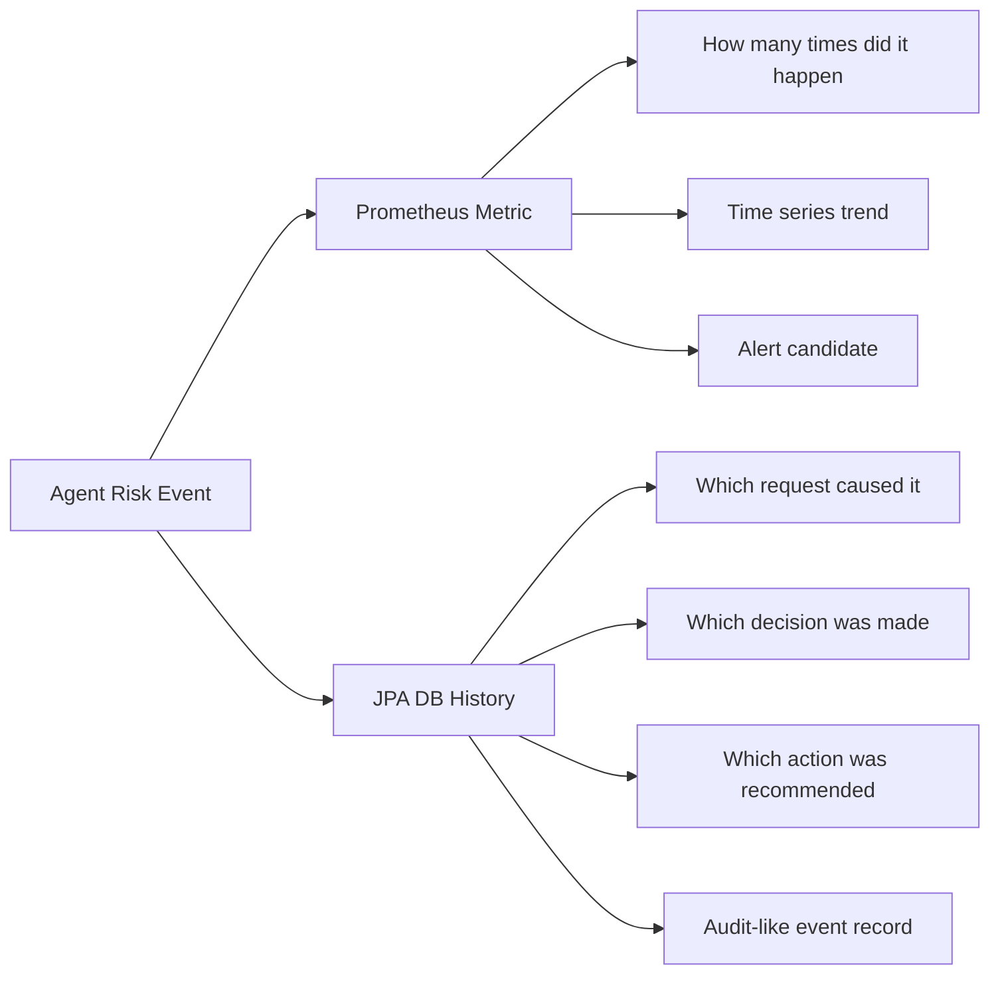

Important idea:

```text
Prometheus = 몇 번 발생했나
DB History = 어떤 요청이 어떤 위험 판단을 받았나
```

## 8. Security Event 흐름

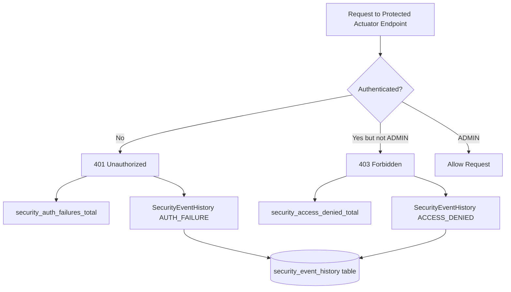

Security meaning:

```text
401 = authentication failure = who are you?
403 = authorization failure = I know who you are, but you do not have permission.
```

## 9. Admin Dashboard API 흐름

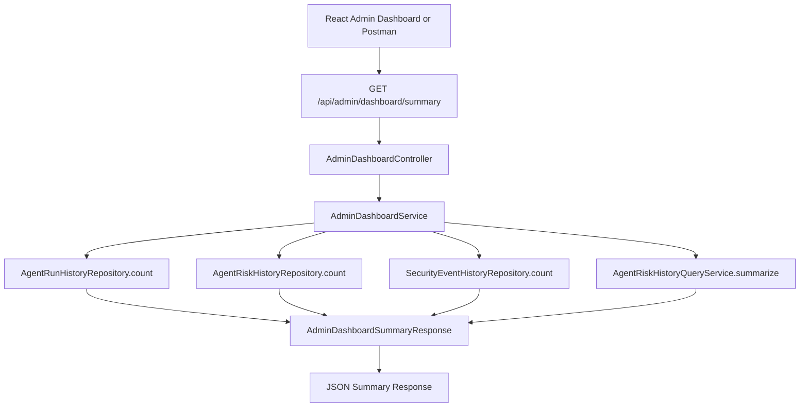

Admin summary purpose:

```text
React 화면은 나중에 붙여도 된다.
중요한 것은 백엔드가 dashboard-ready JSON을 줄 수 있다는 점이다.
```

## 10. Guardrail Adapter 확장 흐름

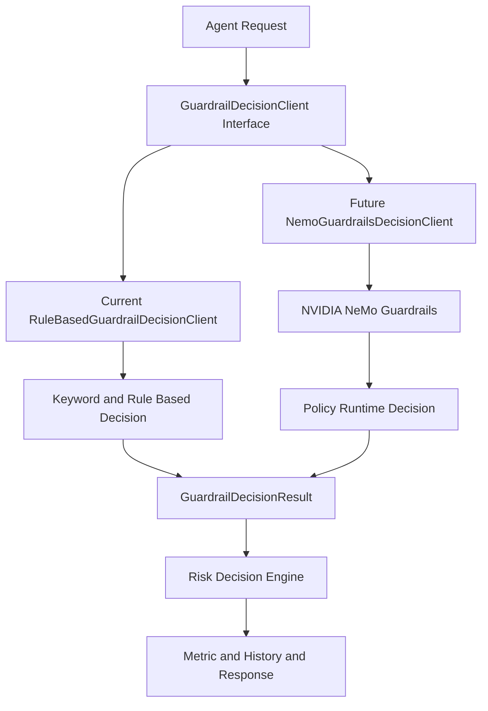

Current:

```text
GuardrailDecisionClient -> RuleBasedGuardrailDecisionClient
```

Future:

```text
GuardrailDecisionClient -> NemoGuardrailsDecisionClient
```

## 11. React 연결 최소 흐름

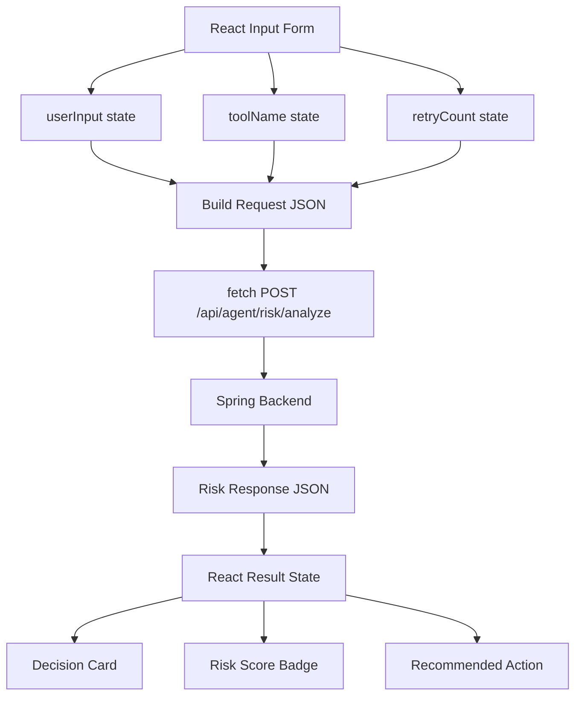

Frontend role:

```text
프론트는 판단하는 곳이 아니다.
프론트는 JSON을 보내고 결과를 보여주는 창구다.
위험 판단, metric 기록, JPA 저장은 백엔드가 담당한다.
```

## 12. 학습용 최종 지도

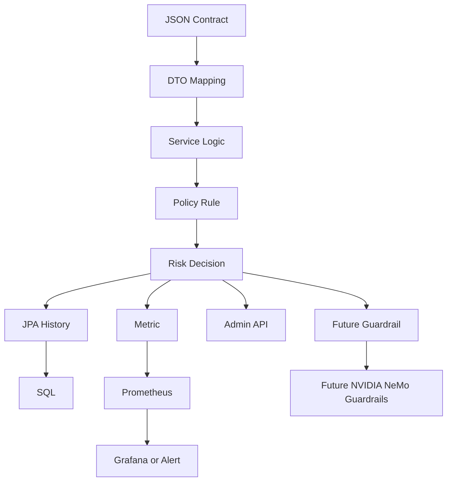

One sentence to memorize:

```text
JSON으로 들어온 agent 요청을 DTO로 받고,
Service에서 위험 신호를 해석하고,
metric과 JPA history로 남긴 뒤,
guardrail-ready decision을 JSON으로 반환한다.
```
