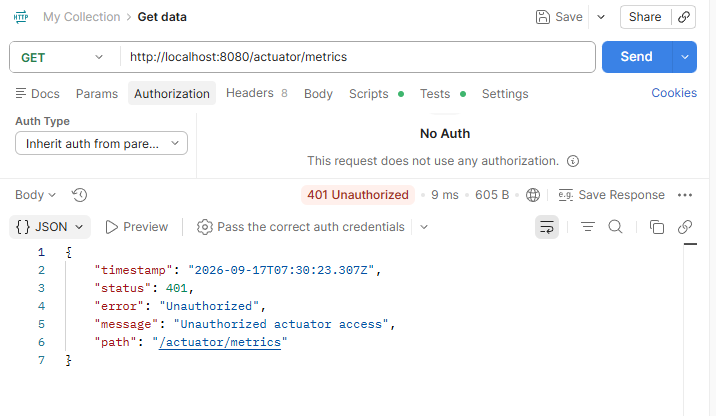
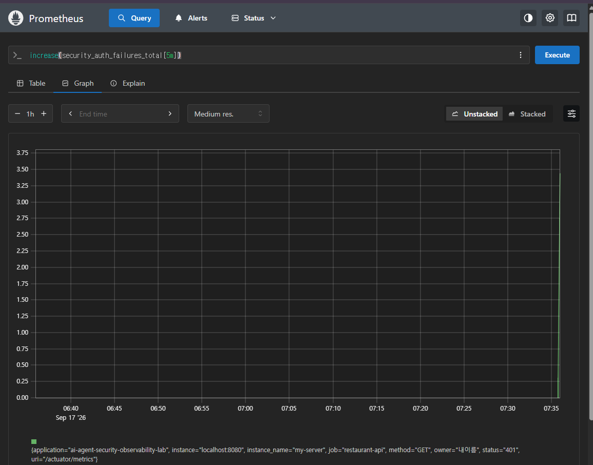
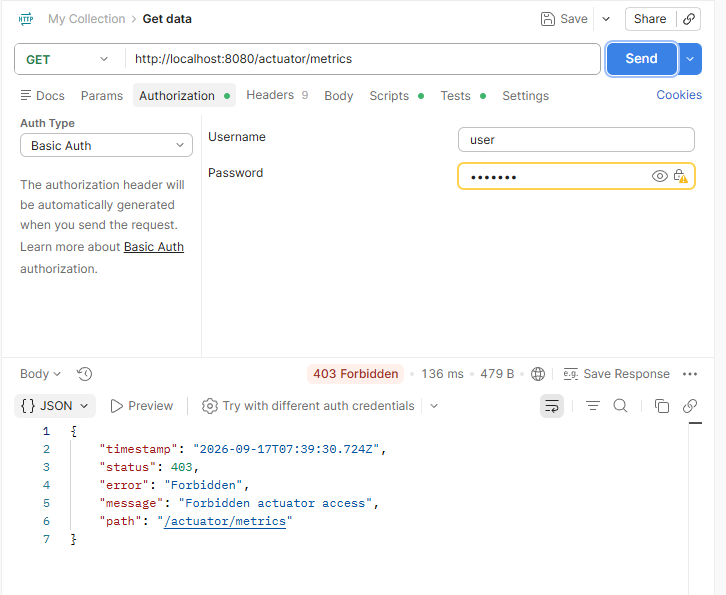
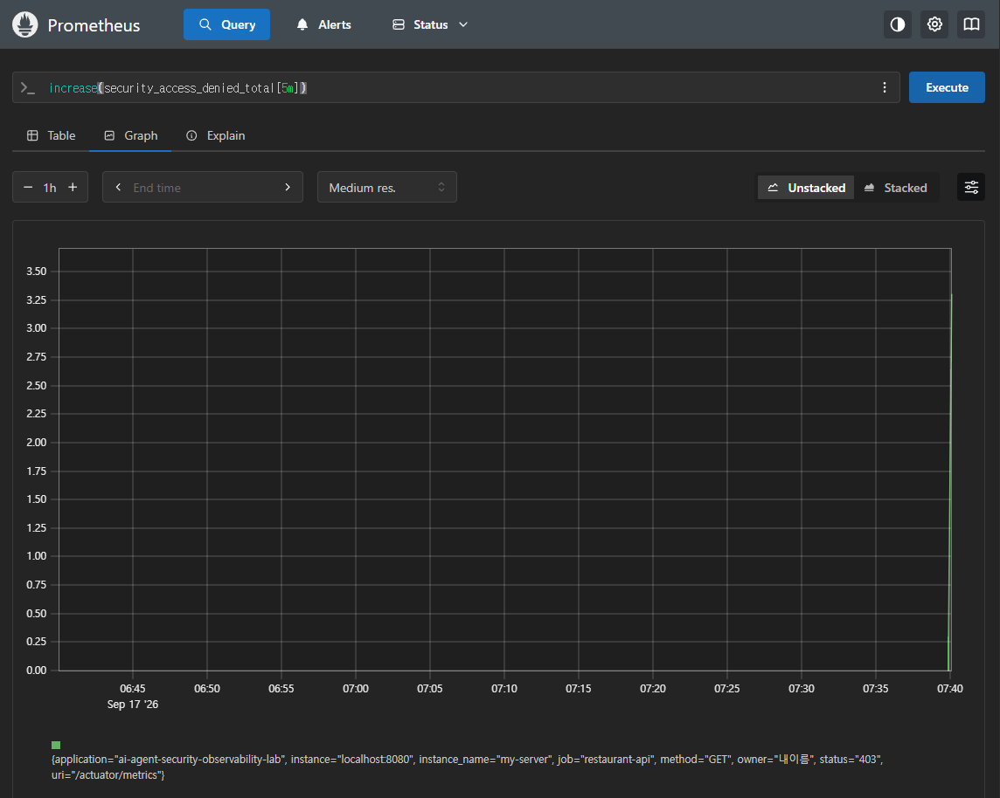
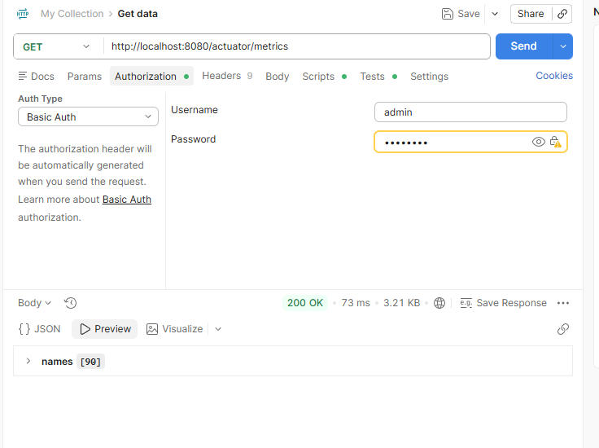
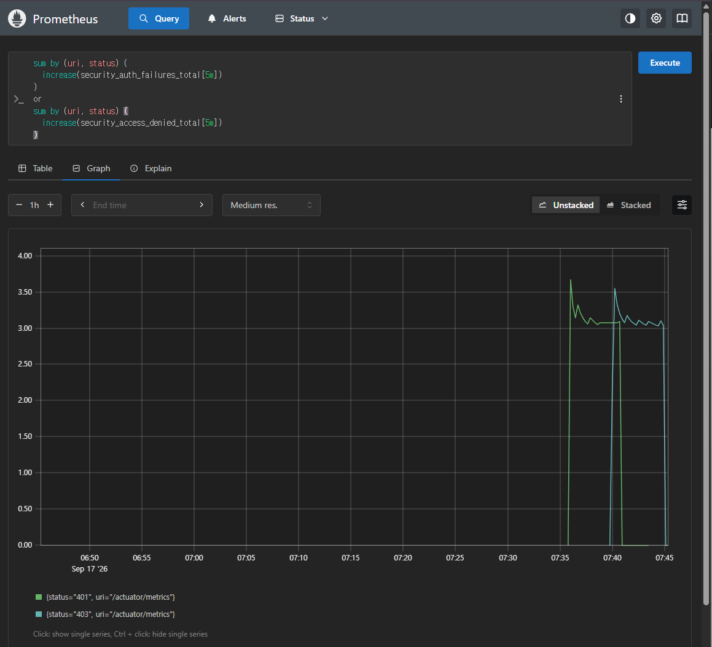

# Spring Security Observability Portfolio

This page records the Spring Security evidence added to the AI Agent Security Observability Lab.

Core thesis:

```text
Security events should be measured, not only blocked.
```

The lab protects operational Actuator endpoints and records authentication and authorization failures as Prometheus metrics.

## Security Rule

Committed default:

```text
/actuator/health
/actuator/info
-> public

other /actuator endpoints
-> ADMIN role required
```

During local evidence capture, `/actuator/prometheus` was temporarily opened so Prometheus could scrape the new security metrics without Basic Auth. After the evidence was captured, the committed default was restored so `/actuator/prometheus` is protected again.

Production direction:

```text
Keep /actuator/prometheus protected or internal-only.
If Prometheus needs to scrape it, configure Prometheus with Basic Auth or restrict access at the network layer.
```

## Test Accounts

```text
admin / admin123
role: ADMIN
```

```text
user / user123
role: USER
```

## 1. No Auth -> 401 Unauthorized

Request:

```http
GET /actuator/metrics
Authorization: none
```

Expected:

```text
401 Unauthorized
```

Evidence:



PromQL:

```promql
increase(security_auth_failures_total[5m])
```

Evidence:



Interpretation:

```text
An unauthenticated request tried to access a protected operational endpoint.
The request was blocked with 401 and recorded as security_auth_failures_total.
```

Concept:

```text
401 = authentication failure
Authentication asks: Who are you?
```

## 2. Non-Admin User -> 403 Forbidden

Request:

```http
GET /actuator/metrics
Authorization: Basic user / user123
```

Expected:

```text
403 Forbidden
```

Evidence:



PromQL:

```promql
increase(security_access_denied_total[5m])
```

Evidence:



Interpretation:

```text
The user was authenticated but did not have the ADMIN role.
The request was blocked with 403 and recorded as security_access_denied_total.
```

Concept:

```text
403 = authorization failure
Authorization asks: Are you allowed to do this?
```

## 3. Admin User -> 200 OK

Request:

```http
GET /actuator/metrics
Authorization: Basic admin / admin123
```

Expected:

```text
200 OK
```

Evidence:



Interpretation:

```text
The ADMIN user can access the protected operational endpoint.
This confirms that the endpoint is not broken; it is role-protected.
```

## 4. 401 and 403 as Observable Signals

PromQL:

```promql
sum by (uri, status) (
  increase(security_auth_failures_total[5m])
)
or
sum by (uri, status) (
  increase(security_access_denied_total[5m])
)
```

Evidence:



Interpretation:

```text
Authentication failures and authorization failures are visible as separate metric series.
This makes protected endpoint access attempts observable in Prometheus.
```

## PM / Security Meaning

Basic security testing often stops at:

```text
401 happened.
403 happened.
```

This lab goes one step further:

```text
401 happened -> security_auth_failures_total increased
403 happened -> security_access_denied_total increased
```

That means blocked security events become operational signals.

## Connection to Agent Security

This complements the agent behavior metrics:

```text
agent_policy_violation_total
agent_retry_count_total
agent_external_api_calls_total
security_auth_failures_total
security_access_denied_total
```

Together, these metrics support a broader AI agent security question:

```text
What behavior, cost, and protected-surface access should be visible before an AI agent is trusted with autonomy?
```
