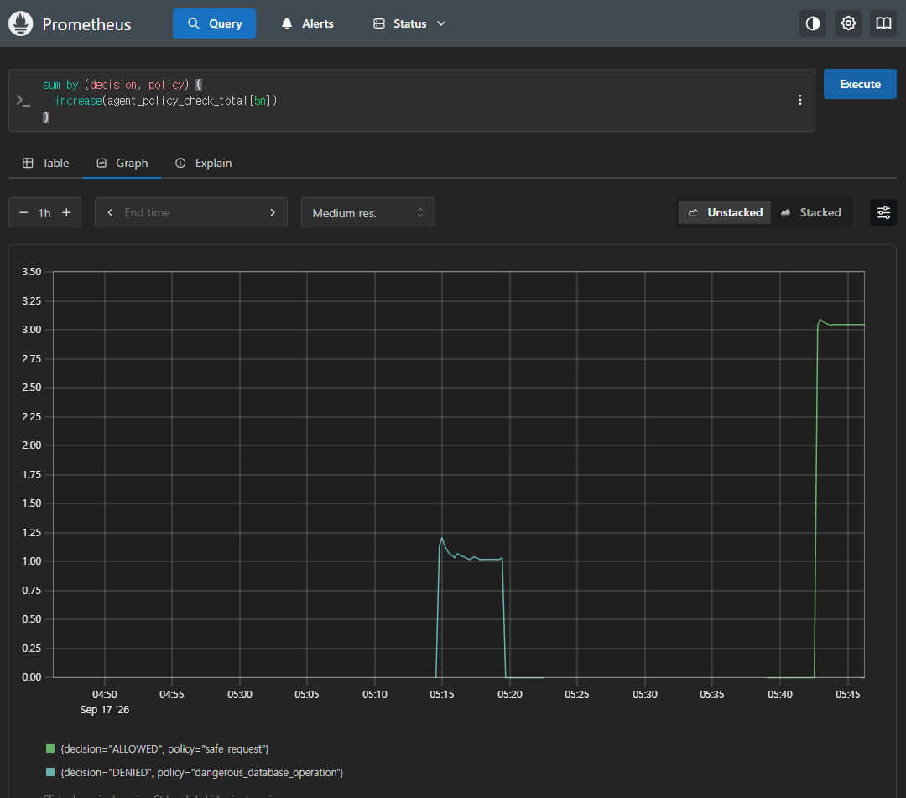
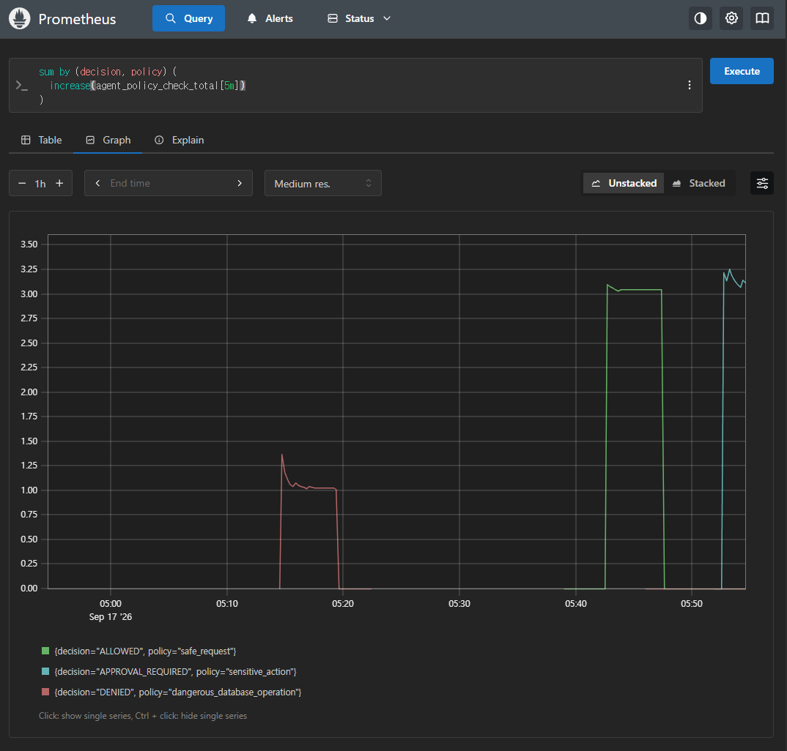

# Full Evidence Screenshot Gallery

This page collects the captured evidence images in one place.

The README shows only two representative screenshots. This page keeps the full experiment set visible for portfolio review.

## AI Agent Policy Checks

## Combined Agent Risk Patterns

## Spring Security Observability

