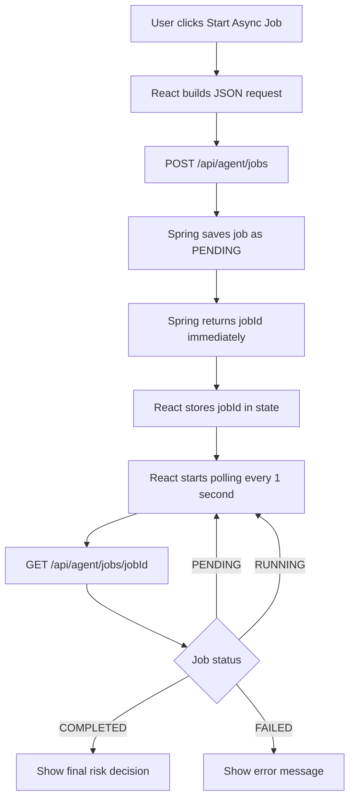
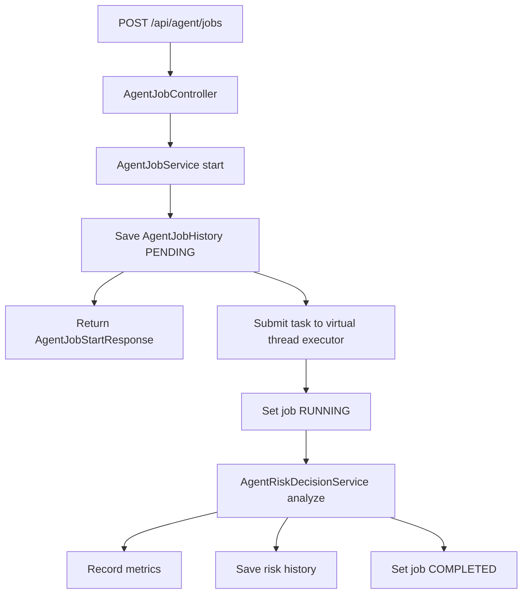
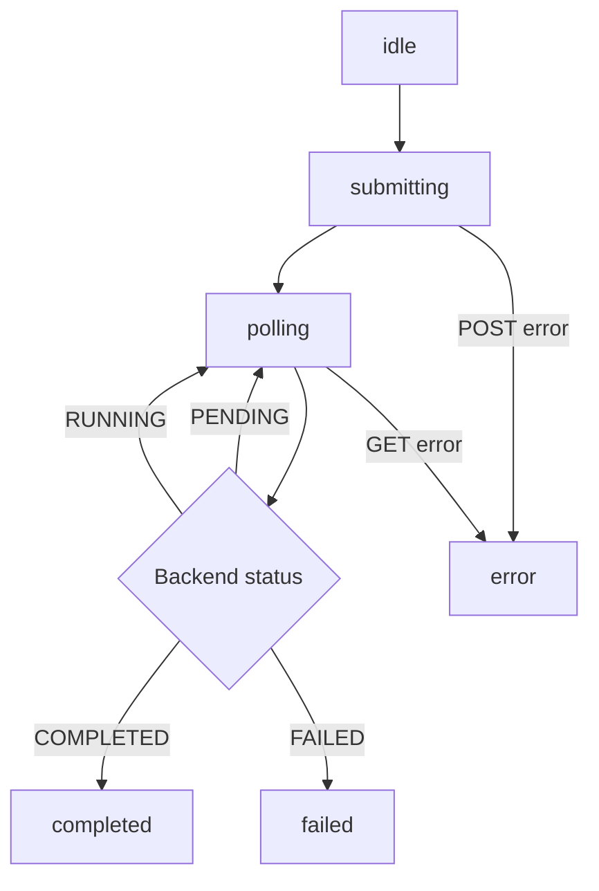

# Virtual Thread Job Polling UI

This page explains the frontend and backend async flow used by:

```text
docs/frontend/react-virtual-thread-job-polling.html
```

The goal is to show asynchronous API integration without using SSE or WebSocket.

```text
POST /api/agent/jobs
-> receive jobId
-> poll GET /api/agent/jobs/{jobId}
-> display job status
-> show final risk decision
```

## 1. Overall Flow



## 2. Backend Flow



The important point:

```text
The first HTTP request does not wait for the whole analysis.
It only creates the job and returns jobId.
The real work continues on a Java 21 virtual thread.
```

## 3. Frontend State Flow



Frontend state meaning:

```text
idle
-> the user has not started a job yet

submitting
-> React is sending POST /api/agent/jobs

polling
-> React has received jobId and is checking the job status every 1 second

completed
-> backend finished the virtual thread job and returned a risk decision

failed
-> backend job failed

error
-> frontend could not call the backend API
```

## 4. Why This Is Async

Synchronous API:

```text
Frontend sends request
-> backend finishes all work
-> backend returns final response
```

Example:

```text
POST /api/agent/risk/analyze
-> returns decision immediately after analysis
```

Asynchronous job API:

```text
Frontend sends request
-> backend accepts job
-> backend returns jobId first
-> backend keeps working in the background
-> frontend repeatedly checks status
```

Example:

```text
POST /api/agent/jobs
-> returns jobId

GET /api/agent/jobs/{jobId}
-> returns PENDING or RUNNING or COMPLETED
```

## 5. Why Polling Is Enough Here

SSE and WebSocket are useful when the server must push events to the browser in real time.

This project does not need that yet.

Polling is enough because:

```text
the job is short
the frontend only needs status updates
the backend already has a job status API
the concept is easier to explain in a portfolio
```

Portfolio meaning:

```text
This UI proves that the frontend can connect to a backend async job model.
It also connects JavaScript async fetch with Java 21 virtual thread backend execution.
```

## 6. Code Reading Map

Frontend:

```text
startJob
-> sends POST /api/agent/jobs
-> receives jobId
-> starts setInterval
```

```text
pollJob
-> sends GET /api/agent/jobs/{jobId}
-> updates React state
-> stops polling on COMPLETED or FAILED
```

Backend:

```text
AgentJobController
-> receives API request
```

```text
AgentJobService start
-> saves PENDING job
-> returns jobId
-> submits background work
```

```text
AgentJobService process
-> sets RUNNING
-> analyzes risk
-> sets COMPLETED or FAILED
```

